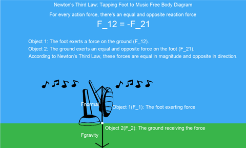

# Newton's Third Law Project - PHY 150

## 📽 Watch the Completed GIF of Free Body Diagram from Python Code:

### Instructions for Running the Code
--------------------------------------

## Technologies Used
- Python
- Matplotlib
- Adobe Illustrator (for graphical assets)

## Steps to Run the Code:
1. Extract the `TappingFootForcePair` ZIP file into a folder.
2. Ensure the folder contains:
   - The Python code file (`.py`)
   - An "assets" folder with the following subfolders:
      - `foot` folder with foot images
      - `musical_notes` folder
      - `bkgrnd` folder
      - `arrows` folder
3. To run the code:
   - Make sure you have Pygame installed by running `pip install pygame` in the terminal.
   - Run the Python code using your preferred Python IDE.
4. If you encounter any issues:
   - Check that the asset paths in the code match the folder structure.
   - Ensure that the assets are properly extracted and in the correct location.

Enjoy the Newton's Third Law animation!
